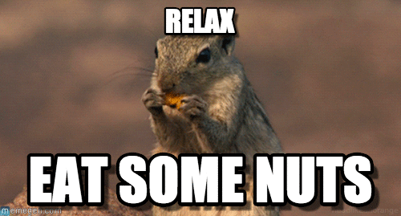

  # __Hewy__
  <h3>software dev, music producer and just a bruh</h3>

  

  <h5>PS. That's actually me:)</h5>

  ---

  # __Languages I prefer__
  
  
  
  
  
  

  # __Already tried__
  
  
  
  
  
  
  
  
  # __Help me to create powerful things__
  

  

  <!--<h5>Who tf is Tovio? @toivoparnpuu</h5>-->
  <!--<h5>Molodei</h5>-->
  <!--<h5>Grisha is evil</h5>-->
  <h5>* PS bought 164 nut afterlives</h5>

